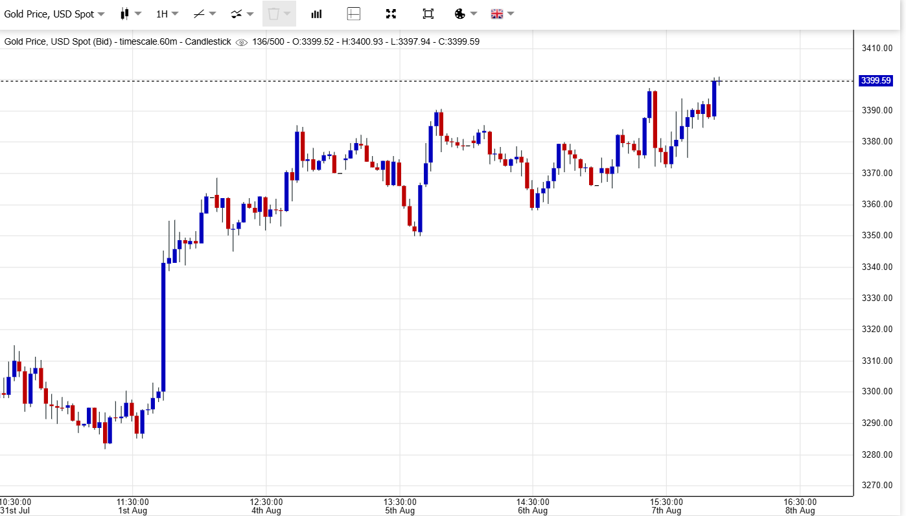
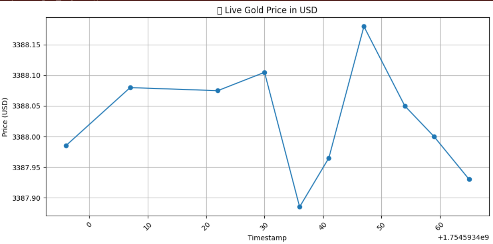
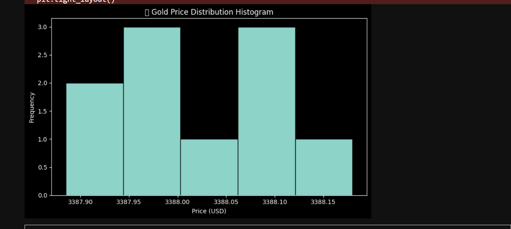

# 📈 Live Gold Price Prediction and Visualization

This project uses **Machine Learning** and **real-time gold price data** to predict and visualize gold price trends. It combines historical gold price data and live API integration to show predictions and price fluctuations on various charts.

---

## 💡 Features

- 🔮 Predict gold prices using Linear Regression
- ⏱️ Fetch live gold price every few seconds using public API
- 📊 Visualize:
  - Actual vs Predicted Prices
  - Real-time Live Gold Price (Line Chart)
  - Price Distribution (Histogram)

---

## 📌 Technologies Used

- Python 🐍
- pandas, numpy
- scikit-learn
- matplotlib
- requests

---

## 📂 Dataset

- **Historical Gold Price Data**  
  Source: [monthly.csv](https://raw.githubusercontent.com/datasets/gold-prices/master/data/monthly.csv) from the [datasets/gold-prices](https://github.com/datasets/gold-prices) GitHub repo.

- **Live Gold Price API**  
  Fetched from: [metals.live API](https://api.metals.live/v1/spot/gold)

---

## 📸 Sample Output

### 🔴 Real-Time Gold Price Line Chart



### 🔵 Price Distribution Histogram



---

## 🚀 How to Run

1. Clone this repo:
   ```bash
   git clone https://github.com/your-username/gold-price-prediction.git
   cd gold-price-prediction
